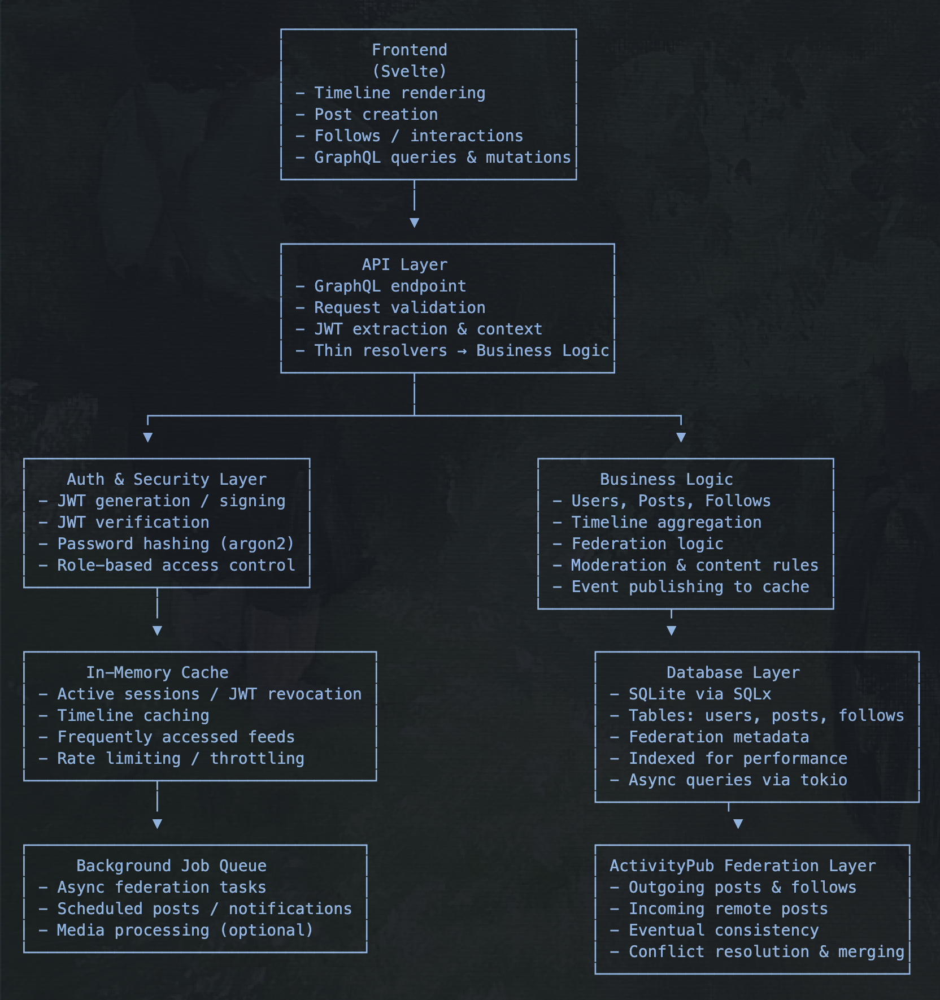

---

# $RustWave ➤

A Rust-based ActivityPub engine that can plug into the Fediverse as a full-fledged social server.

---

# $Architecture ➤

---

# $Features ➤

- **Decentralized :** Federated via ActivityPub; users interact across instances.

- **GraphQL API :** Queries and mutations for users, posts, follows, timelines.

- **JWT Auth** with argon2 password hashing.

- **Business Logic :**  User management, posts, follows, timelines, moderation.

- **In-Memory Cache :**  Sessions, timelines, revoked JWTs, rate-limiting.

- **Persistent Storage :** SQLite via SQLx; async queries; indexed tables.

- **Background Jobs :** Async federation, scheduled posts, notifications, media processing.

- **Federation Layer :** Send/receive posts, maintain consistency, conflict resolution.
